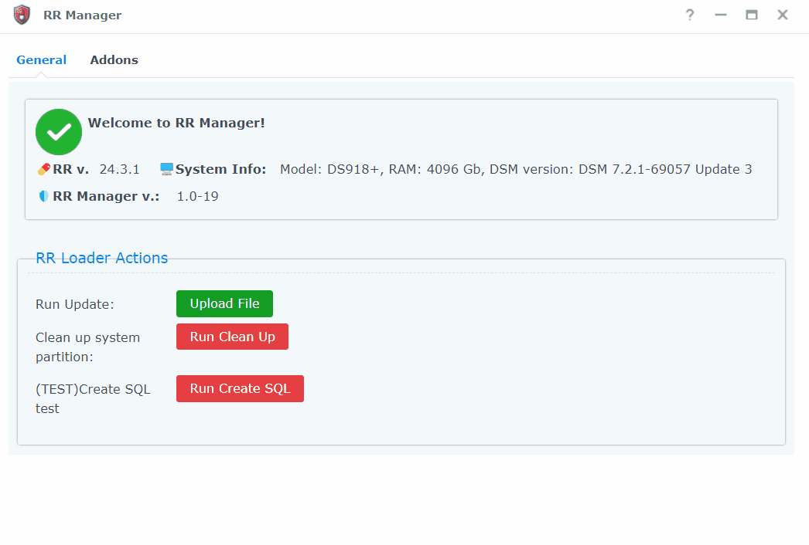

# What is that?

RRManager is a Redpill Recovery DSM application aimed to provide the ability to configure/update RR without booting to RR recovery. This package is for experienced users. 

❗❗❗ Required `RR v.24.2.4`

### Features
 - [x] upload and install update from the DSM
 - [x] run custom jobs with ui(`clean_system_disk.cgi`, etc..)
 - [x] no more marked as virus 
 - [ ] manage addons (in progress)

That app is built on the `DSM` UI framework: `Ext.Js 3.4`.
I didn't find documentaion regarding that framework, so I spent a lot of time to reserch how to build ui and call DSM actions utilyzing that approach. That is why the ui is so unperfect))

# Instalation
1. Download RR Manager spk file from github
2. Install SPK, specify the path to store RR artifacts
3. Follow the guide to create necessary resources

## How does it work?
During the app install, you can specify the folders to store the RR artifacts during the update process. You can also select the folders and shares created during the installation or populate existing shares.

In my case the share is `rr` and the temp folder is `tmp`.
So the RR Manager will upload the updated file to the `/volumeX/rr/tmp/update.zip`.

Please note that you need to upload `updateX.zip(updateall-24.3.0)`, not `rr-23.11.1.img.zip`.
 I will add that validation in the future.

## TODO:
- [ ] Fix ui to make it responsive
- [ ] Add localizations

